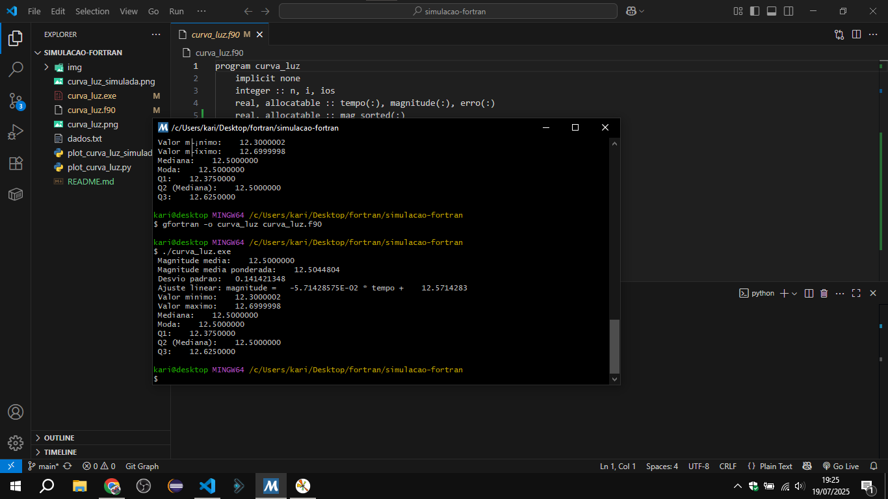
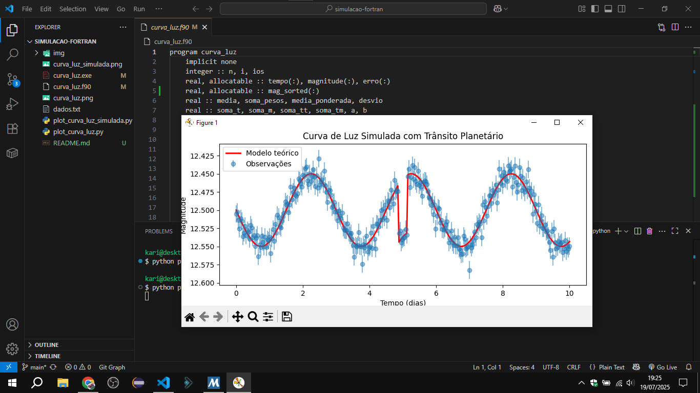

# simulação e análise de curvas de luz

repositório para estudar e entender em fortran os dados observacionais. escolhi o fortran por ser uma linguagem conhecida na área e comecei pelo básico, com a intenção de expandir e voltar a estudar sobre a análise de curvas de luz porém em código.

  
  

